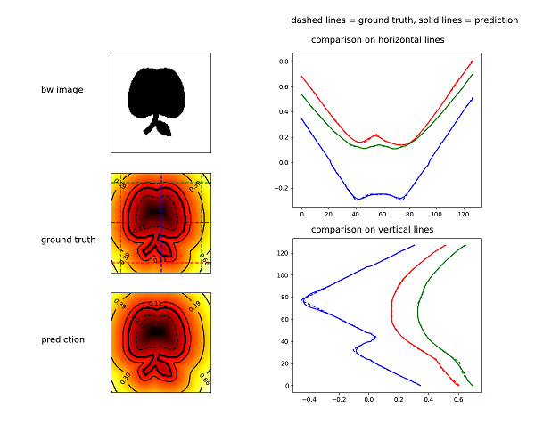

# Signed Distance Function Prediction

This repo contains implementation of a neural network system for generating accurate signed distance fields (SDF) for 2D
 geometries. The geometry is assumed to be a black-white square image where the background pixels are 0 and the object
  pixels are 1. 

## Requirements
see `requirements.txt`

## run 
`python main.py -m MODE [--optional-keys optional_vals]`
`Mode` is a mandatory parameter, and can be either of 
 - `train`: to train the model 
 - `test`: to test the model
 - `test exotic`: to test the model on the exotic dataset; see `datasets/exotic_shapes/png_images` 
 - `visualize`: to visualize the model
Optional parameters include:
 - `--n-obj`: initial number of objects for training. multiplied 9x after augmentation, default=`500`
 - `--img-res`: image resolution, default=`128`
 - `--data-folder`: folder where data are stored, default= `data/datasets/`
 - `--dataset-id`: name of dataset, default= `all` + `img_res`
 - `--network-id`: network id. see `src/network/network_lib.py` for all networks available. default=`UNet1`
 - `--data-type`: data type can be `float32` or `float64`. default=`float32`
 - `--n-epochs`: number of epochs, default=`100`
 - `--batch-size`: batch size, default=`10`
 - `--save-every`: save network every x epochs, default=`10`
 - `--learning-rate`: (initial) learning rate, default=`1e-3`
 - `--min-learning-rate`: minimum value of learning rate, default=`1e-6` 
 - `--plateau-patience`: plateau patience parameter in learning rate scheduling, default=`3`
 - `--plateau-factor`: plateau factor parameter in learning rate scheduling, default=`0.2`
 - `--validation-fraction`: portion of data that is used for validation, default=`0.2`
 - `--checkpoints-directory`: folder that all data during train and test will be saved in.
 - `--n-predict`: number of predictions during testing

## Data generation  
The learning data are generated from a list of primitive objects including circle, rectangle, diamond
 and polygon. The analytical expression of the SDF of these primitive geometries are 
 available in `data/geom.py` on a `[-1,1] x [-1,1]` domain. 
 Initially `n-obj` of these geometries are produced with random sizing and location. 
 This initial set will be augmented in several different ways including rotation, translation, 
 scaling, rounding (making corners round), adding hole. 
 In addition, more complex geometries that contain 2 or 3 single geometries are added to the dataset. 
 Because of some problems discussed [here](https://www.iquilezles.org/www/articles/interiordistance/interiordistance.html), 
 SDFs are eventually recomputed using two euclidean distance transformations. 

 To generate new datasets, run `python main.py -m generate_data`. 

## Visualization
Run in `test` or `test_exotic` mode first so that test results are computed ans stored. 
Run in `visualize` mode for visualization. number of predictions are controlled by `--n-prediction` option.